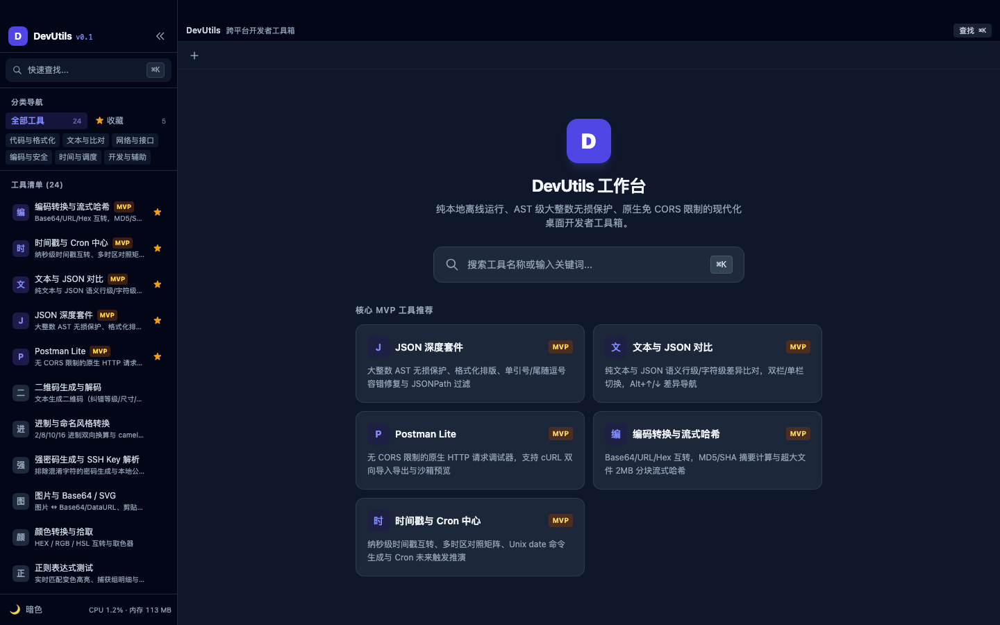
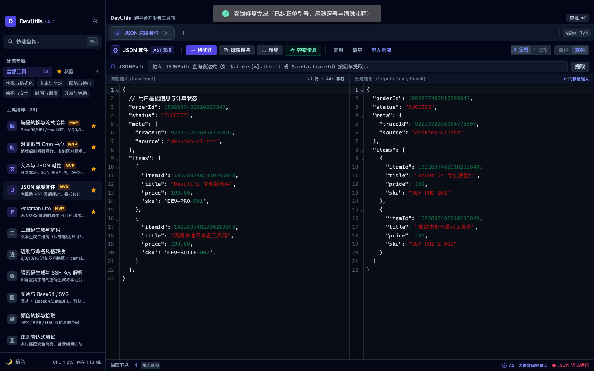

<div align="center">
  
</div>

<h1 align="center">DevUtils</h1>

<p align="center">
  纯本地离线运行、AST 级大整数无损保护、原生免 CORS 限制的跨平台开发者工具箱
</p>

<p align="center">
  
  
  
  
  
</p>

---

## 简介

DevUtils 是一个把日常开发中零散的小工具收进一个窗口的桌面应用：24 个工具、多标签工作台、输入自动持久化，全部数据留在本机。

它不只是「一堆网页工具的壳」，几个刻意做实的点：

- **纯本地离线**：不联网、不上报、不依赖任何远端服务；只有你主动使用 Postman Lite / WebSocket 时才会发起网络请求。
- **原生网络栈**：HTTP 与 WebSocket 走 Rust 侧 `reqwest` / 原生 `WebSocket`，不受浏览器 CORS 限制，可以直连内网接口。
- **大整数无损**：19 位雪花 ID 之类的长整数全程以字符串 AST 传递，不经过 `JSON.parse` 的浮点截断，末位 100% 保真。
- **流式大文件哈希**：2MB 分块读取，内存占用恒定，支持中途取消，结果与 `shasum -a 256` 一致。
- **工作台级体验**：多标签 + LRU 驻留、命令面板（`⌘K` / `Ctrl+K`）、深浅主题、关闭标签页后资源立即释放。

## 截图

<div align="center">
  
</div>

## 工具清单（24 个）

### 代码与格式化

| 工具 | 说明 |
| --- | --- |
| JSON 深度套件 | 大整数 AST 无损保护、格式化排版、单引号/尾随逗号容错修复与 JSONPath 过滤 |
| YAML / Properties / JSON 互转 | 三栏实时联动双向互转与点分扁平化属性键转换 |
| YAML 语法校验器 | YAML 语法校验、行列错误定位与格式化 / 压缩输出 |
| TOML 语法校验器 | TOML 语法校验、行列错误定位与格式化输出 |
| JSON 转强类型结构体 | 输入 JSON 自动推导生成 TypeScript、Go、Java POJO/Record、Rust Struct |
| SQL 格式化与压缩 | 多方言 SQL 语法美化、大小写对齐与单行压缩 |
| Excel / CSV 转 JSON 与 SQL | 粘贴或导入 TSV/CSV，推导类型并生成 JSON 数组或多方言批量 INSERT |
| Markdown / HTML 预览 | GFM 实时渲染、双向同步滚动、代码块高亮与 HTML 导出 |

### 文本与比对

| 工具 | 说明 |
| --- | --- |
| 文本与 JSON 对比 | 纯文本与 JSON 语义行级/字符级差异比对，双栏/单栏切换，`Alt+↑/↓` 差异导航 |

### 网络与接口

| 工具 | 说明 |
| --- | --- |
| Postman Lite | 无 CORS 限制的原生 HTTP 请求调试器，支持 cURL 双向导入导出与沙箱预览 |
| URL 解析与构造器 | 复杂 URL 结构拆解与 Query 参数双向表格化编辑 |
| WebSocket 实时测试 | WS/WSS 长连接保活心跳、快捷消息模板与实时收发日志 |

### 编码与安全

| 工具 | 说明 |
| --- | --- |
| 编码转换与流式哈希 | Base64/URL/Hex 互转，MD5/SHA 摘要计算与超大文件 2MB 分块流式哈希 |
| 强密码生成与 SSH Key 解析 | 排除混淆字符的密码生成与本地公钥指纹提取解析 |
| JWT 解析与调试 | 三段式色彩高亮解析、Claims 过期时间倒计时与签名重签 |
| X.509 证书解析 | PEM/DER/Base64 证书解析，主体、有效期、SAN、扩展与 SHA-1/SHA-256 指纹 |

### 时间与调度

| 工具 | 说明 |
| --- | --- |
| 时间戳与 Cron 中心 | 纳秒级时间戳互转、多时区对照矩阵、Unix `date` 命令生成与 Cron 未来触发推演 |

### 开发与辅助

| 工具 | 说明 |
| --- | --- |
| 进制与命名风格转换 | 2/8/10/16 进制双向换算与 camelCase/snake_case/kebab-case 命名切换 |
| Linux chmod 权限计算器 | 数字权限（如 `755`）与符号权限（`rwxr-xr-x`）双向转换 |
| 正则表达式测试 | 实时匹配变色高亮、捕获组明细与内置常见规则库 |
| UUID / 雪花 ID / Mock 数据 | UUID v1/v4/v7、NanoID、雪花 ID 与中文测试 Mock 数据批量生成 |
| 颜色转换与拾取 | HEX / RGB / HSL 互转与取色器 |
| 图片与 Base64 / SVG | 图片 ↔ Base64/DataURL、剪贴板粘图、等比缩放重编码与 SVG 压缩 |
| 二维码生成与解码 | 文本生成二维码（纠错等级/尺寸/颜色）与剪贴板图片解码 |

## 工作台能力

- **多标签 + 单例**：同一个工具只会开一个标签，重复点击只做激活。
- **LRU 驻留**：最多同时保留 5 个标签的 DOM，超出自动卸载，避免长期使用后内存膨胀。
- **输入持久化**：标签、输入与视图选项以 250ms 防抖写入本地 SQLite，重启后原样还原；派生的渲染结果不落库。
- **命令面板**：`⌘K` / `Ctrl+K` 搜索并打开任意工具。
- **主题**：深色 / 浅色跟随系统，也可手动切换。
- **资源占用**：左下角实时显示本应用进程的 CPU 与内存占用，窗口不可见时自动停止采样。
- **关闭即释放**：标签页关闭后，定时器、事件监听、WebSocket 连接、编辑器实例与图片位图都会被清理（详见 `docs/superpowers/`）。

## 快速开始

### 环境要求

- **Node.js** 22+（CI 使用 22）
- **Rust** stable（1.88+）与 Cargo
- **macOS**：Xcode Command Line Tools
- **Windows**：MSVC 构建工具；WebView2 运行时（安装包已配置为缺失时自动引导安装）
- **Linux**：需要 `webkit2gtk`、`libayatana-appindicator` 等系统依赖（当前发布流程未覆盖 Linux 构建）

### 开发

```bash
npm install
npm run tauri dev      # 启动完整桌面应用（含 Rust 后端）
```

只想调前端界面时可以跑 `npm run dev`：界面能在浏览器里预览，但依赖 Rust IPC 的工具（Postman、WebSocket、X509、大文件哈希等）不可用。

### 构建

```bash
npm run build          # 类型检查 + 前端产物
npm run tauri build    # 打包当前平台安装包
```

产物位置：`src-tauri/target/release/bundle/`。

### 测试

```bash
npm test                                        # 前端单测 + CI 级验收用例
npm run test:benchmark                          # 本地基准（>5MB 夹具，不进 CI）
cargo test --manifest-path src-tauri/Cargo.toml # Rust 单测
cargo clippy --manifest-path src-tauri/Cargo.toml --all-targets -- -D warnings
```

## 技术栈

**前端**：Vue 3 + TypeScript + Vite，Naive UI + Tailwind CSS，Pinia，CodeMirror 6，`marked` / `DOMPurify` / `highlight.js`，`qrcode` / `jsqr`。

**后端**：Tauri 2 + Rust，`reqwest`（HTTP / SOCKS5）、`similar`（Diff）、`sha2` / `sha3` / `sha-1` / `md-5` / `hmac`、`chrono` / `chrono-tz` / `croner`、`x509-parser`、`sysinfo`、`rusqlite` + `tokio-rusqlite`。

**存储**：本地 SQLite（`tool_state_snapshots` 存标签与输入快照，`sys_settings` 存全局设置）。

## 项目结构

```
.
├─ src/                      # Vue 3 前端
│  ├─ components/            # 布局与通用组件（侧边栏、标签栏、命令面板、资源状态）
│  ├─ composables/           # 组合式函数
│  ├─ stores/                # Pinia：标签页、主题、工具偏好
│  ├─ types/tool.ts          # 工具注册表（24 个工具的唯一来源）
│  ├─ utils/                 # 跨工具共享工具函数
│  └─ views/tools/<Tool>/    # 每个工具一个目录：视图 + utils + __tests__
├─ src-tauri/                # Rust 后端
│  ├─ src/commands/          # Tauri 命令：diff / http / hash / cron / file / x509 / metrics
│  ├─ src/db/                # SQLite 迁移与访问
│  ├─ icons/                 # 各平台打包图标（由 public/app-icon.svg 生成）
│  └─ tauri.conf.json
├─ tests/ci/                 # CI 级验收用例
├─ tests/manual/             # 本地基准用例
├─ docs/superpowers/         # 分阶段设计规范与实施计划
└─ .github/workflows/        # ci.yml（测试与构建）、release.yml（打 tag 发布）
```

## 数据与隐私

- 所有数据都留在本机，应用不包含任何遥测或统计上报。
- 数据库位置：`<应用数据目录>/devutils.db`，macOS 下为 `~/Library/Application Support/com.devutils.app/devutils.db`。
- 只有主动使用 Postman Lite / WebSocket 时才会向外发起网络请求。
- Markdown 预览运行在 `iframe sandbox` 沙箱中并额外做 HTML 消毒；CSP 收紧为 `default-src 'self'`，仅按需放行 `connect-src`（ws/wss）与 `img-src data:`。

## 发布流程

发布由 `.github/workflows/release.yml` 驱动：

1. 更新 `CHANGELOG.md`，新增 `## v<版本号>` 章节；
2. 打 tag 并推送（如 `git tag v1.0.0 && git push origin v1.0.0`），或在 Actions 页面手动触发并填写版本号；
3. 工作流以 tag 作为唯一版本来源，构建前写回 `package.json` 与 `src-tauri/tauri.conf.json`，然后并行构建 Windows x64、macOS arm64 与 macOS x64；
4. 从 `CHANGELOG.md` 提取对应章节作为 Release 说明，直接发布正式 Release（非草稿）。

## 设计文档

分阶段的设计规范与实施计划都在 [`docs/superpowers/`](docs/superpowers/) 下，包含每个工具的能力边界、工程约定（快照契约、错误处理、测试要点）与已知取舍。

## 已知限制

- macOS 产物未做签名与公证，首次打开需要在「系统设置 → 隐私与安全性」中放行。
- 发布工作流目前只覆盖 Windows x64 与 macOS（arm64 / x64），未包含 Linux 与 Windows arm64。
- Postman Lite 的在途请求不会因为关闭标签页而中止，会在超时（默认 30s）后自行结束。
- 「另存为」目前是手填路径，没有接入系统文件选择对话框。

## 许可证

本项目尚未添加开源许可证文件。在补充 `LICENSE` 之前，默认保留所有权利。
