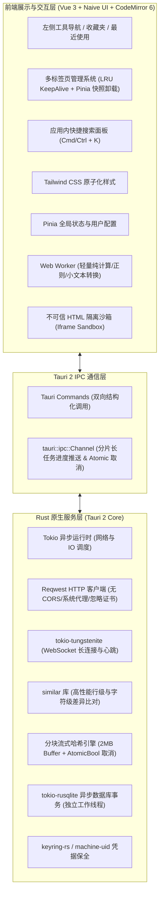
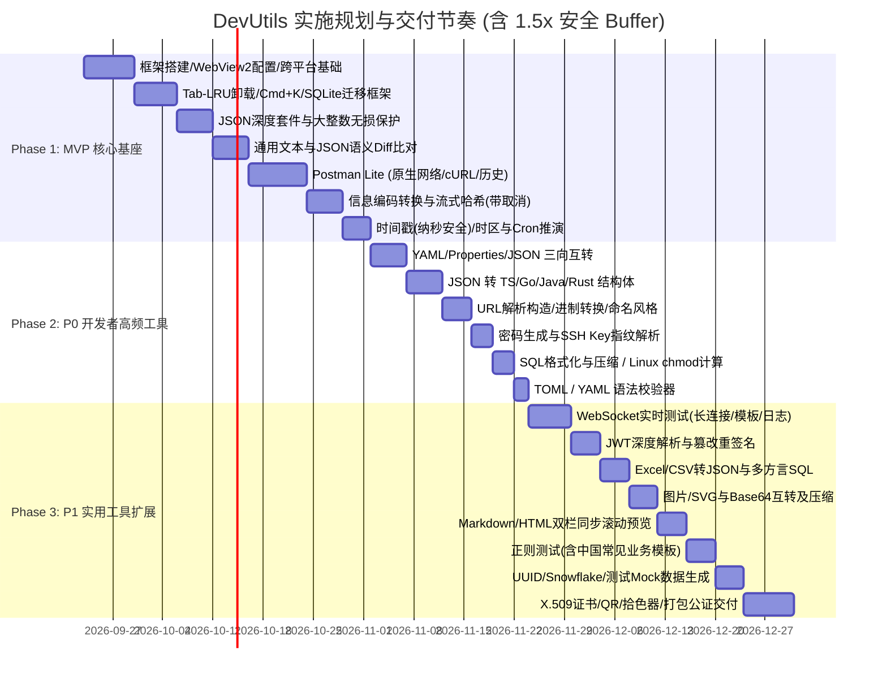

# Tauri 2 + Vue 3 跨平台开发者工具箱（DevUtils）需求与工程落地设计规范

**文档版本**：v1.2.1（终审冻结版）  
**更新日期**：2026-09-22  
**目标平台**：macOS (Apple Silicon & Intel) / Windows 10 & 11 (x64 & ARM64)  
**核心技术栈**：Tauri 2 + Rust + Vue 3 + TypeScript + Naive UI + CodeMirror 6 + Tailwind CSS + tokio-rusqlite  

---

## 1. 项目定位与工程化指标

### 1.1 项目定位
本项目是一款为软件工程师量身打造的**完全离线、低资源消耗、无数据泄露风险**的跨平台桌面开发工具箱。以高频核心场景（JSON 处理与结构体生成、文本/代码比对、原生网络调试、时间与编码转换、格式互转）为基本盘，采用务实高效的工程分工，兼顾即开即用的流畅度与大文件处理的稳定性。

### 1.2 科学可测的性能指标（P50 验收基准）
指标定义明确至**从点击启动到首屏绘制且主线程可交互（TTI, Time to Interactive）**：
* **冷启动耗时（Cold Start P50 到 TTI）**：
  * macOS：**< 1.2s**
  * Windows（包含 WebView2 运行时首次加载初始化）：**< 2.0s**
  * 热启动/托盘唤醒：**< 200ms**
* **内存基准指标（物理驻留内存 RSS）**：
  * 应用启动空载静置（1 分钟后）：**macOS < 90MB，Windows < 130MB**（正视 Windows WebView2 自身 80MB~110MB 底噪）。
  * 5 个常用工具 Tab 并发工作状态：**< 180MB**。
  * 具备超过 5 个 Tab 时的 LRU 实例销毁与 DOM 彻底卸载机制。
* **大文本承载能力**：
  * 100,000 行（约 5MB~10MB）JSON / 文本能够正常载入、平滑虚拟滚动、支持全文搜索，**内存波动增量 < 60MB，绝不发生 UI 白屏崩溃或主进程卡死**。
* **数据精度原则**：
  * 超过 JavaScript `Number.MAX_SAFE_INTEGER`（9007199254740991）的长整型数值（如 19 位雪花 ID、订单号）全程使用无损 Tokenizer 保持原文字符串。
  * **纳秒级时间戳（19位）**：因超出 JS `Date` 及标准整型安全范围，系统全程以 **纯字符串（String）** 形式透传与计算，严禁转为 JS Number 导致末位失真。
* **隐私与安全性**：
  * 纯本地离线运行，零埋点、零遥测、零数据外流。
  * 敏感凭证（Postman Token、私钥）优先接入 OS 原生 Keyring（Keychain / Windows Credential Manager）；
  * **渲染沙箱隔离（XSS 防御）**：Postman HTML 响应预览与 Markdown HTML 预览均运行在 `<iframe sandbox="allow-same-origin" srcdoc="...">` 隔离沙箱中，**禁用 `allow-scripts`**，彻底阻断恶意脚本执行与 Tauri IPC 提权调用。

---

## 2. 系统总体架构与工程选型

### 2.1 架构拓扑



### 2.2 核心工程决议
1. **样式方案**：收敛为 **Tailwind CSS**，生态成熟，跨平台样式零抖动。
2. **JSON 解析引擎**：Rust 端采用成熟稳健的 **`serde_json`**（辅以自定义 AST 保留长数值原文），不引入维护成本高且 API 不稳定的 `simd-json`。
3. **SQLite 异步驱动**：选用 **`tokio-rusqlite`**，在独立专用线程中顺序执行 SQLite 读写事务，彻底避免阻塞 Tokio 异步网络与 IPC 线程池。
4. **单文件哈希与流式计算原理**：
   * 单文件 SHA-256 计算为串行依赖更新，采用 `std::fs::File` 以 **2MB 固定 Buffer** 进行分块串行读取并更新 Hasher 状态。
   * 物理内存开销恒定在 **< 30MB**；通过 `Arc<AtomicBool>` 作为全局取消标志位，每读完一个 Chunk 校验一次标志位，在 **300ms 容差窗口内** 安全释放文件句柄并退出任务。
   * 进度通过 `tauri::ipc::Channel` 节流推送至前端（每 100ms 最多汇报一次进度百分比与瞬时速度）。
5. **统一大文本与大报文处理三级策略**：
   * **轻量区（< 1MB）**：纯前端/Worker 零延迟就地处理，CodeMirror 启用完整折叠、括号匹配与内联装饰。
   * **中量区（1MB ~ 5MB）**：前端就地处理，CodeMirror 自动切换为“轻量模式”（关闭非视口深层折叠计算，保留纯语法高亮与虚拟滚动）。
   * **重量区（> 5MB）**：**（含 Postman 超大响应报文）** 前端调用 Rust 异步命令分配 `task_id` 后台分片处理；前端编辑器复用“重量区”分块虚拟滚动渲染，仅渲染可视视口行，杜绝全量 DOM 挂载导致主线程卡死。
6. **多 Tab 管理与 LRU 内存卸载策略**：
   * 默认最多保持 **5 个活跃 Tab** 处于 Vue `<KeepAlive>` 状态，切换无延迟。
   * 打开超过 5 个 Tab 时，基于 **LRU（最近最少使用）算法** 自动将最久未访问的 Tab 从 `<KeepAlive>` 中踢出：
     * 触发组件销毁钩子，彻底销毁其 CodeMirror 实例及内部 DOM 树，释放 Webview 内存；
     * 销毁前将其编辑状态、光标行号及输入参数序列化存入 Pinia Store（并同步更新至 SQLite 快照表）；
     * 当用户切回该 Tab 时，自动重建组件并注入状态，毫秒级还原。

---

## 3. 分阶段实施规划与交付节奏（稳健排期）



---

## 4. 第一期（MVP）核心功能规格说明

### 4.1 JSON 深度套件（含大整数精度保护）
* **核心能力**：
  * 美化排版（2空格/4空格/Tab）、紧凑单行化、Key 递归升序/降序排序、转义与去除转义。
  * 容错修复（单引号转双引号、自动去除尾随逗号 `trailing comma`、解析并保留/清除注释）。
  * 实时 JSONPath 过滤查询，输入表达式毫秒级输出子集。
* **大整数精度保护（BigInt Lossless）**：
  * 前端采用无损 Tokenizer 词法流，将 19 位雪花 ID 等长数值维持纯字符串 AST 节点，格式化及导出时不经过 `JSON.parse` 浮点数截断，末位 100% 保真。

### 4.2 通用文本 & JSON 对比工具（Text & JSON Diff）
* **核心能力**：
  * 支持两段任意通用文本（代码片段、日志、配置）与 JSON 数据的精准比对。
  * 双栏分屏（Split）与单栏内联（Inline）自由切换。
  * 差异导航：`Alt + ↑ / ↓` 快速跳转差异点；顶部实时提示 `+新增 / -删除 / ~修改` 统计指标。
* **核心算法**：
  * 纯文本比对：基于 Rust `similar` 库提供字符级与行级高亮。
  * JSON 语义比对：提供“忽略 Key 顺序”预处理选项，递归排序后消除伪差异。

### 4.3 简易 Postman（Postman Lite）
* **网络底座**：
  * 基于 Rust `reqwest` 异步驱动，**完全无视浏览器 CORS 限制**。
  * 原生支持“忽略 SSL 自签名证书校验”、支持 HTTP/SOCKS5 代理、支持重定向开关与超时设置。
* **请求构建**：
  * 请求方法：`GET`, `POST`, `PUT`, `DELETE`, `PATCH`, `HEAD`, `OPTIONS`。
  * URL 参数表（Params）：表格化与 URL 双向同步，支持单个启用/禁用。
  * 标头（Headers）：智能提示，支持表格与纯文本批量编辑一键切换。
  * 请求体（Body）：支持 `none`、`form-data`（文件上传）、`x-www-form-urlencoded`、`raw`（JSON/XML/Text，语法高亮）、`binary`（二进制本地文件流直传）。
  * 认证（Auth）：Bearer Token、Basic Auth、API Key。
  * 环境变量：支持开发/测试环境自由切换，支持 `{{baseUrl}}` 动态变量替换。
  * cURL 互通：支持从剪贴板一键导入 cURL 命令并解析；支持一键导出为 cURL 命令行与各语言代码。
* **响应与历史**：
  * 状态码、耗时（ms）、体积（KB）；Body 支持 Pretty、Raw、图片/HTML 预览及快速搜索。
  * **超大响应保护**：响应体 >5MB 自动复用“重量区”分块虚拟滚动渲染，杜绝卡死。
  * **HTML 预览沙箱**：通过 `<iframe sandbox="allow-same-origin">` 渲染不可信 HTML，禁用脚本执行，杜绝 XSS。
  * 请求历史自动写入 SQLite（保留最近 500 条）；支持收藏至目录结构。

### 4.4 信息编码与流式哈希（Encoding & Hash Studio）
* **编码转换**：
  * Base64（标准与 URL-Safe）、URL 编解码（`encodeURIComponent` 与 `encodeURI`）。
  * Unicode（中文字符 ↔ `\u4e2d\u6587`）、Hex 十六进制字符串互转、HTML 实体转义。
* **摘要与哈希计算**：
  * MD5（32/16位，大小写切换）、SHA-1、SHA-256、SHA-512、**SHA-3**，支持自定义加盐与 HMAC。
* **超大文件哈希秒算（单文件串行流式 + 可取消）**：
  * 允许拖入 10GB+ 超大本地文件。
  * Rust 端采用 2MB 固定 Buffer 分块流式读取与更新 Hasher 状态，物理内存恒定在 **< 30MB**。
  * 前端展示百分比进度条与实时处理速度，配备一键“取消”按钮（基于 `AtomicBool` 标志位在 300ms 容差窗口内安全释放文件句柄）。
  * 输出结果与系统命令行 `shasum -a 256` 绝对一致。

### 4.5 时间戳与本地化时间（Timestamp & Cron Hub）
* **时间戳互转**：
  * 秒（10位）、毫秒（13位）、微秒（16位）、**纳秒（19位）** 自由换算。
  * **纳秒精度保护**：纳秒级时间戳全程以 **String** 传递和计算，杜绝 JS `Number` 溢出。
  * 动态时钟面板：当前时间显示，一键暂停与一键复制当前时间戳。
  * 常用格式矩阵输出：ISO 8601、RFC 2822、UTC、中文本地时间。
  * **Unix `date` 命令互转**：一键生成可在 macOS / Linux 终端直接执行的 `date -r ...` 或 `date -d ...` 命令。
* **时区转换矩阵**：
  * 本地时区、UTC、美东（EST/EDT）、欧洲（CET/CEST）、东京（JST）多时区联动对照。
* **Cron 表达式可视化与推演**：
  * 支持 Linux 5 位与 Quartz 6/7 位表达式，逆向解析为中文自然语言。
  * **推演未来 10 次触发时间**，并明确标注包含当前本地夏令时（DST）状态说明，避免跨时区算错。

---

## 5. 第二期（P0 开发者高频）与第三期（P1）规划规格

### 5.1 第二期（P0）新增高频模块规格
1. **YAML / Properties / JSON 三向互转（刚需）**：
   * 支持三栏实时联动编辑（JSON ↔ YAML ↔ Properties），防抖双向生成。
   * 支持多层嵌套对象与 Properties 风格点分扁平键（如 `spring.datasource.url`）无损双向转换。
   * 数组兼容：支持 `servers[0].url` 与 `servers.0.url` 两种主流解析模式。
2. **JSON ⇄ 类型定义/结构体生成器（刚需）**：
   * 输入任意 JSON 示例，自动推导生成强类型结构定义：
     * **TypeScript**：生成 `interface` 或 `type`（支持可选字段与嵌套命名）。
     * **Go**：生成 `struct`（带 `json:"..."` tag）。
     * **Java**：生成 Lombok POJO 或 Java 16+ Record 类。
     * **Rust**：生成 `#[derive(Serialize, Deserialize)] pub struct`。
3. **URL 解析与构造器**：
   * 自动将复杂 URL 拆解为 Protocol、Host、Port、Path、Query Params（表格化编辑增删改查）、Hash。
4. **进制转换与字符串/代码命名风格处理器**：
   * **进制转换**：2进制、8进制、10进制、16进制双向联动。
   * **命名风格互转**：`camelCase` ↔ `snake_case` ↔ `kebab-case` ↔ `PascalCase` ↔ `CONSTANT_CASE` 批量转换。
   * **文本行处理**：快速去重、行排序（字典序/数值序）、去除空白行、前后缀批量拼接。
5. **强密码生成器 & SSH Key 指纹查看**：
   * 密码生成：配置长度、字符集、排除混淆字符（`0/O, 1/l`），密码强度评测。
   * SSH Key 查看：解析本地公钥文件（`id_rsa.pub`、`id_ed25519.pub`），提取展示 Key Type、Bits、注释及 SHA256 指纹。
6. **SQL 格式化与压缩**、**Linux chmod 权限计算器**（数字 755 ↔ `rwxr-xr-x` 互转）、**TOML / YAML 语法校验器**。

### 5.2 第三期（P1）新增模块规格
* **WebSocket 调试工具**：长连接管理、断线自动重连、心跳定时保活（Ping/Pong）、快捷指令模板（统一复用 `app_favorites` 表）与流式日志检索。
* **JWT 解析与调试**：三段式色彩高亮、Claims 过期时间倒计时雷达、签名校验（HS256/RS256）、Payload 篡改反向重签。
* **Excel/CSV 文本转 JSON/SQL**：粘贴板 TSV/文件上传，智能表头识别与类型推导，多方言（MySQL/PG/SQLite/Oracle）批量 Insert 脚本生成。
* **图片与 Base64 / SVG 处理**：剪贴板粘图、Base64 还原本地保存、SVG 代码压缩优化与 DataURL 生成。
* **Markdown / HTML 互转与实时预览**：CodeMirror 6 与渲染区精准双向同步滚动、GFM 规范、语法高亮与导出，HTML 预览同样采用 `iframe sandbox` 隔离不可信脚本。
* **正则表达式测试**：实时匹配变色高亮、捕获组分色明细、替换实时预览、内置中文开发者高频规则库（手机号、身份证、统一社会信用代码、银行卡）。
* **UUID / Snowflake / 常见 Mock 数据生成**：UUID v1/v4/v7、NanoID、雪花算法，以及常见测试用 Mock 数据（中文姓名、测试手机号、模拟身份证、随机地址）。
* **X.509 证书解析**、**二维码生成与解码**、**颜色转换与拾取（HEX ↔ RGB ↔ HSL）**。

---

## 6. 本地持久化与 SQLite 数据架构设计

### 6.1 迁移与版本控制机制（`schema_migrations`）

```sql
CREATE TABLE IF NOT EXISTS schema_migrations (
    version INTEGER PRIMARY KEY,
    applied_at INTEGER NOT NULL,
    description TEXT NOT NULL
);
```

### 6.2 核心持久化表结构与裁剪索引设计

```sql
-- 1. 系统与用户偏好表
CREATE TABLE IF NOT EXISTS sys_settings (
    key TEXT PRIMARY KEY,
    value TEXT NOT NULL,
    updated_at INTEGER NOT NULL
);

-- 2. 标签页与工具快照表（崩溃与重启恢复工作区，关闭 Tab 时显式删除对应记录）
CREATE TABLE IF NOT EXISTS tool_state_snapshots (
    tab_id TEXT PRIMARY KEY,
    tool_id TEXT NOT NULL,
    title TEXT NOT NULL,
    sort_order INTEGER NOT NULL,
    snapshot_data_json TEXT NOT NULL,
    updated_at INTEGER NOT NULL
);
CREATE INDEX IF NOT EXISTS idx_snapshots_updated ON tool_state_snapshots(updated_at);

-- 3. 通用收藏夹表（统一管理各工具的常用片段与 WebSocket 模板）
CREATE TABLE IF NOT EXISTS app_favorites (
    id TEXT PRIMARY KEY,
    tool_id TEXT NOT NULL,       -- 如 'postman', 'ws_template', 'regex_snippet'
    title TEXT NOT NULL,
    category TEXT,
    content_json TEXT NOT NULL,
    created_at INTEGER NOT NULL,
    sort_order INTEGER DEFAULT 0
);
CREATE INDEX IF NOT EXISTS idx_favorites_tool ON app_favorites(tool_id);

-- 4. 通用最近使用记录表
CREATE TABLE IF NOT EXISTS app_recents (
    id TEXT PRIMARY KEY,
    tool_id TEXT NOT NULL,
    summary TEXT NOT NULL,
    payload_json TEXT NOT NULL,
    accessed_at INTEGER NOT NULL
);
CREATE INDEX IF NOT EXISTS idx_recents_tool_accessed ON app_recents(tool_id, accessed_at DESC);

-- 触发器：app_recents 每个工具超过 50 条时自动修剪老数据
CREATE TRIGGER IF NOT EXISTS trg_prune_app_recents
AFTER INSERT ON app_recents
BEGIN
    DELETE FROM app_recents
    WHERE tool_id = NEW.tool_id
      AND id NOT IN (
          SELECT id FROM app_recents
          WHERE tool_id = NEW.tool_id
          ORDER BY accessed_at DESC LIMIT 50
      );
END;

-- 5. Postman 环境变量表
CREATE TABLE IF NOT EXISTS http_environments (
    id TEXT PRIMARY KEY,
    name TEXT NOT NULL,
    variables_json TEXT NOT NULL,
    is_active INTEGER DEFAULT 0,
    created_at INTEGER NOT NULL
);

-- 6. Postman 请求集合目录树表
CREATE TABLE IF NOT EXISTS http_collections (
    id TEXT PRIMARY KEY,
    parent_id TEXT,
    name TEXT NOT NULL,
    sort_order INTEGER DEFAULT 0
);

-- 7. Postman 收藏请求详情表
CREATE TABLE IF NOT EXISTS http_requests (
    id TEXT PRIMARY KEY,
    collection_id TEXT,
    name TEXT NOT NULL,
    method TEXT NOT NULL,
    url TEXT NOT NULL,
    headers_json TEXT,
    params_json TEXT,
    body_type TEXT,
    body_content TEXT,
    auth_json TEXT,
    settings_json TEXT,
    created_at INTEGER NOT NULL,
    updated_at INTEGER NOT NULL,
    FOREIGN KEY(collection_id) REFERENCES http_collections(id) ON DELETE CASCADE
);

-- 8. Postman 请求历史日志表（限制保留最新 500 条）
CREATE TABLE IF NOT EXISTS http_history (
    id TEXT PRIMARY KEY,
    method TEXT NOT NULL,
    url TEXT NOT NULL,
    status_code INTEGER,
    duration_ms INTEGER,
    request_data_json TEXT,
    response_summary_json TEXT,
    executed_at INTEGER NOT NULL
);
CREATE INDEX IF NOT EXISTS idx_history_executed ON http_history(executed_at DESC);

-- 触发器：http_history 超过 500 条时自动修剪老数据
CREATE TRIGGER IF NOT EXISTS trg_prune_http_history
AFTER INSERT ON http_history
BEGIN
    DELETE FROM http_history
    WHERE id NOT IN (
        SELECT id FROM http_history ORDER BY executed_at DESC LIMIT 500
    );
END;
```

### 6.3 凭据与敏感数据安全策略
* **首选方案**：调用操作系统原生凭据库（macOS Keychain / Windows Credential Manager，基于 `keyring-rs` 驱动）。
* **Fallback 降级策略**：
  * 若系统凭证库不可用，不重复造硬件指纹轮子，改用成熟标准的 `machine-uid` crate 获取设备唯一标识，结合应用初次启动生成的全局 Salt，通过 PBKDF2 派生出 256 位 AES-GCM 密钥。
  * 若用户在异机恢复 SQLite 导致解密失败，系统进行静默保护并提示“凭证已在旧设备加密，请重新输入更新”，坚决杜绝因解密异常引起程序崩溃或敏感数据明文外泄。

---

## 7. 桌面级运维与跨平台交付细节

### 7.1 Windows 平台专属适配
* **WebView2 依赖保障**：在 `tauri.conf.json` 中配置 WebView2 安装策略为 `downloadBootstrapper`，缺失时自动引导安装，杜绝黑屏。
* **窗口状态记忆与贴靠**：使用 `tauri-plugin-window-state` 记忆退出前的窗口位置、尺寸与最大化状态；支持 Windows 11 Snap Layouts 贴靠分屏。
* **打包交付**：支持输出标准 x64/ARM64 `NSIS` 安装程序及免安装便携版（Portable `.zip`）。

### 7.2 macOS 平台专属适配
* **沉浸式窗口**：启用 `titleBarStyle: "Overlay"`，保留系统原生红绿灯，顶栏预留安全拖拽区（`data-tauri-drag-region`）。
* **通用二进制（Universal Binary）**：同时支持 Apple Silicon (aarch64) 与 Intel (x86_64)，一键打包为 Universal `.dmg`。
* **代码签名与公证**：预留 Apple Developer 证书签名配置与公证脚本，防止 Gatekeeper 拦截。

### 7.3 应用运维、日志与隐私控制
* **标准日志目录**：
  * macOS: `~/Library/Logs/DevUtils/app.log`
  * Windows: `%APPDATA%\DevUtils\logs\app.log`
  * 基于 `tracing-appender` 每日滚动，仅保留最近 7 天日志，超出自动删除。
* **隐私模式与数据清理**：设置面板支持“一键清除所有历史记录与快照”，支持“无痕模式”开关。
* **备份文件标准格式（带版本号）**：
  * 导出 `.json` 备份文件必须包含顶层元数据，例如：
    ```json
    {
      "app": "DevUtils",
      "version": 1,
      "exported_at": 1790000000000,
      "data": {
        "settings": { ... },
        "favorites": [ ... ],
        "environments": [ ... ],
        "collections": [ ... ],
        "requests": [ ... ]
      }
    }
    ```
  * 导入时必须校验 `version` 字段，确保向下兼容迁移。
* **快捷键自定义与国际化（i18n）**：支持自定义主键映射，架构预留 `vue-i18n`（首期支持**简体中文**与 **English**）。

---

## 8. 可执行自动化验收用例与标准

| 序号 | 测试领域 | 验证步骤与断言 |
| :--- | :--- | :--- |
| **TC-01** | 长整数与纳秒精度 | 输入包含 19 位雪花 ID 及 19 位纳秒时间戳的文本，进行格式化、转换与导出，断言数值 100% 精确一致，无末位截断或科学计数法变形。 |
| **TC-02** | 原生 CORS 穿透 | 在 Postman 模块向配置严格 CORS 校验的外部服务发送 POST 请求，断言能成功接收 200 响应报文与 Headers，无跨域拦截异常。 |
| **TC-03** | 忽略自签名证书 | 在 Postman 中开启“忽略证书错误”，向自签名本地 HTTPS 服务发起请求，断言能成功握手并正常返回。 |
| **TC-04** | 大文件哈希与取消 | 拖入 5GB 大文件执行 SHA-256 计算，验证进度条平滑递增、UI 不卡顿；中途点击“取消”，断言在 **300ms 容差窗口内** 释放文件句柄并终止计算；完整计算后结果与系统 `shasum -a 256` 字符串一致。 |
| **TC-05** | 10万行 JSON 承载力 | 载入 100,000 行（约 6MB）格式化 JSON 文本，滚动浏览、折叠节点、执行全局搜索，断言内存增量波动 < 60MB，无白屏或无响应警告。 |
| **TC-06** | 空载常驻内存基准 | 启动应用静置 1 分钟，测量进程实际物理驻留内存（RSS），断言满足：macOS < 90MB，Windows < 130MB。 |
| **TC-07** | 数据库迁移与修剪 | 1. 插入 505 条测试请求日志，断言触发器自动生效，`http_history` 稳定维持在 500 条；<br>2. 连续向同一工具插入 55 条最近记录，断言 `app_recents` 触发器自动修剪至 50 条；<br>3. 重启应用断言数据库迁移检查通过。 |
