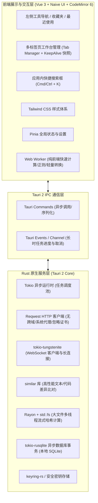
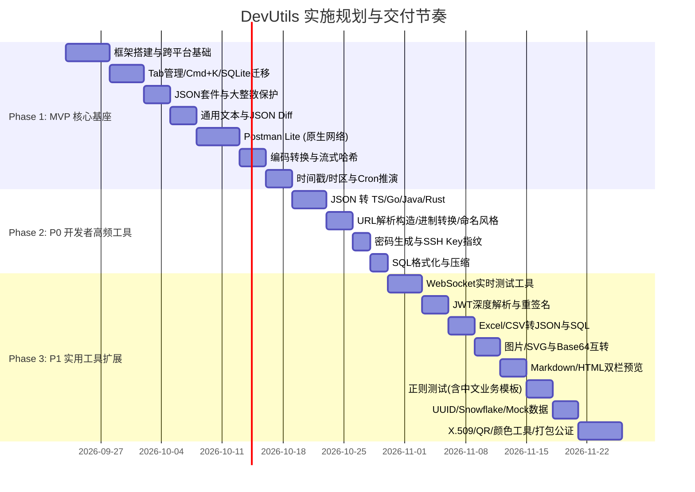

# Tauri 2 + Vue 3 跨平台开发者工具箱（DevUtils）需求与工程落地设计规范

**文档版本**：v1.1.0（工程落地评审修订版）  
**更新日期**：2026-09-22  
**目标平台**：macOS (Apple Silicon & Intel) / Windows 10 & 11 (x64 & ARM64)  
**核心技术栈**：Tauri 2 + Rust + Vue 3 + TypeScript + Naive UI + CodeMirror 6 + Tailwind CSS + tokio-rusqlite  

---

## 1. 项目定位与工程化指标

### 1.1 项目定位
本项目是一款为软件工程师量身打造的**完全离线、低资源消耗、无数据泄露风险**的跨平台桌面开发工具箱。以高频核心场景（JSON 数据处理与代码生成、文本/代码比对、原生网络调试、时间与编码转换）为基本盘，采用务实高效的工程分工，兼顾即开即用的流畅度与大文件处理的稳定性。

### 1.2 务实工程性能与指标（P50 验收基准）
针对 Windows WebView2 初始化与多 Tab 实例的实际物理限制，调整为科学可测的工程指标：
* **冷启动耗时（Cold Start P50）**：
  * macOS：**< 800ms**
  * Windows（包含 WebView2 运行时首次拉起）：**< 1.5s**
  * 热启动/隐藏唤醒：**< 200ms**
* **内存基准指标（Working Set / RSS）**：
  * 应用启动空载静置：**< 100MB**（Windows WebView2 底噪常驻约 80MB-110MB，macOS 约 60MB-85MB）。
  * 日常多 Tab（打开 5 个常见工具并录入数据）：**< 180MB**。
  * 具备非活动 Tab 实例 DOM 卸载与内存修剪（Memory Trim）机制。
* **大文本承载能力**：
  * 100,000 行（约 5MB~10MB）JSON / 文本能够正常载入、平滑虚拟滚动、支持全文搜索，**绝不发生 UI 白屏崩溃或主进程卡死**。
* **数据精度原则**：
  * 超过 JavaScript `Number.MAX_SAFE_INTEGER`（9007199254740991）的长整型数值（如 19 位雪花 ID、订单号）全程使用文本/无损 Tokenizer 保持原始数值串，杜绝末位失真。
* **隐私与安全性**：
  * 纯本地离线运行，零埋点、零遥测、零数据外流。
  * 敏感凭证（如 Postman Authorization Token、私钥）支持系统安全存储或本地加密。

---

## 2. 系统总体架构与工程选型

### 2.1 架构拓扑
摒弃概念化微内核，采用标准的现代桌面应用工程架构：



### 2.2 核心技术选型决议（收敛落地）
* **CSS 样式方案**：收敛为 **Tailwind CSS**，生态成熟稳定，配置标准，无跨平台样式抖动。
* **JSON 解析引擎**：Rust 端采用成熟稳健的 **`serde_json`**（结合自定义 AST 维持 BigInt 原文），不引入维护成本高、编译复杂的 `simd-json`，除非后期 benchmark 证实有明显瓶颈。
* **SQLite 异步驱动**：选用 **`tokio-rusqlite`**，在独立专用工作线程中执行 SQLite 读写事务，彻底避免阻塞 Tokio 异步网络与 IPC 线程池。
* **IPC 大数据与异步进度控制**：
  * 文本/数据 < 1MB：直接通过标准 Tauri `invoke` 传递。
  * 数据 > 1MB（如超大文件哈希、巨量文本比对）：前端发起任务并获取 `task_id`，Rust 端通过 `tauri::ipc::Channel` 定期向前端回报处理进度（%）；前端支持随时触发 `cancel_task(task_id)` 中止底层计算。

---

## 3. 分阶段实施规划（MVP 优先）

为避免因功能面铺得过大而导致项目难产，研发采用 **“三期迭代法”**：



---

## 4. 第一期（MVP）核心功能规格说明

### 4.1 JSON 深度套件（含大整数精度保护）
* **核心功能**：
  * 格式化（2空格/4空格/Tab）、紧凑压缩、Key 递归升序/降序排序、转义与反转义。
  * 容错修复（单引号纠正、去除尾随逗号、解析注释）。
  * 实时 JSONPath 查询过滤，毫秒级输出匹配子集。
* **大整数精度保护（BigInt Lossless）**：
  * 前端采用 `json-bigint` 或 CodeMirror 原生词法流解析，将长整型转换为特定 AST 节点，在格式化输出时严格保证 19 位数值不丢失。
* **大文件处理策略**：
  * >2MB 自动进入低开销模式（关闭非必要装饰层）；>10MB 提示开启折叠渲染。

### 4.2 通用文本 & JSON 对比工具（Text & JSON Diff）
* **核心功能**：
  * 不仅支持 JSON 对比，**全面支持任意通用文本（代码片段、日志、配置）快速粘贴比对**。
  * 视图模式：双栏分屏（Split）与单栏内联（Inline）自由切换。
  * 差异导航：`Alt + ↑ / ↓` 快速跳转差异块；顶部展示 `+新增 / -删除 / ~修改` 统计指标。
* **核心算法**：
  * 纯文本 Diff：基于 Rust `similar` 库，字符级与行级精细高亮。
  * JSON 语义 Diff：对比前提供“忽略键次序”预处理开关，先进行 Key 递归排序再行比对，消除伪差异。

### 4.3 简易 Postman（Postman Lite）
* **网络引擎**：
  * 基于 Rust `reqwest` 异步驱动，原生彻底**绕过浏览器 CORS 跨域拦截**。
  * 支持开关“忽略 SSL 自签名证书错误”，支持配置 HTTP/SOCKS5 代理。
* **请求构建**：
  * 请求方法：`GET`, `POST`, `PUT`, `DELETE`, `PATCH`, `HEAD`, `OPTIONS`。
  * URL 参数表（Params）：键值表格与 URL 双向同步，支持逐项启用/禁用。
  * 标头（Headers）：常见 Header 智能提示，支持一键切换“表格视图 / 纯文本批量编辑”。
  * 请求体（Body）：`none`、`form-data`（支持文件上传）、`x-www-form-urlencoded`、`raw`（JSON/XML/Text，语法高亮）。
  * 认证（Auth）：Bearer Token、Basic Auth、API Key。
  * 环境变量：支持配置开发/测试多套环境，支持 `{{baseUrl}}` 动态变量替换。
  * cURL 互通：支持从剪贴板一键解析导入 cURL 命令；一键导出为 cURL 命令行与各语言代码。
* **响应展示**：
  * 状态码（彩色高亮）、响应耗时（ms）、体积（KB）。
  * 响应体支持 Pretty 格式化、Raw 报文、图片/HTML 预览；支持快捷键搜索。
* **历史与收藏**：
  * 请求自动持久化至本地 SQLite 历史表（限制保留最近 500 条）；支持收藏至目录结构。

### 4.4 信息编码与流式哈希（Encoding & Hash Studio）
* **基础编码转换**：
  * Base64（标准与 URL-Safe）、URL 编解码（`encodeURIComponent` 与 `encodeURI`）。
  * Unicode（中文字符 ↔ `\u4e2d\u6587`）、Hex 十六进制字符串互转、HTML 实体转义。
* **摘要与哈希计算**：
  * MD5（32/16位，大小写切换）、SHA-1、SHA-256、SHA-512，支持加盐与 HMAC。
* **超大文件哈希秒算（防假死与可取消）**：
  * 允许拖入超大文件（10GB+）。
  * Rust 端采用 `std::fs::File` 分块流式读取与多线程并行哈希计算，内存常驻稳定在 <30MB。
  * 前端展示百分比进度条与实时速率（MB/s），**提供一键“取消计算”按钮**。
  * 算法输出与系统命令行 `shasum -a 256` 保证 100% 绝对一致。

### 4.5 时间戳与本地化时间（Timestamp & Cron Hub）
* **时间戳互转**：
  * 秒（10位）、毫秒（13位）、微秒（16位）、纳秒（19位）多级单位自由换算。
  * 动态时钟面板：当前时间显示，一键暂停与一键复制当前时间戳。
  * 常用格式矩阵输出：ISO 8601、RFC 2822、UTC、中文本地时间。
  * **Unix `date` 命令互转**：一键生成可在 macOS / Linux 终端直接执行的 `date -r ...` 或 `date -d ...` 命令，便于快速排障。
* **时区转换矩阵**：
  * 本地时区、UTC、美东（EST/EDT）、欧洲（CET）、东京（JST）多时区联动对照。
* **Cron 表达式可视化与推演**：
  * 支持 Linux 5 位与 Quartz 6/7 位表达式。
  * 逆向解析为通俗中文自然语言。
  * **推演未来 10 次触发时间**，并明确标注包含当前本地夏令时（DST）状态说明，避免跨时区算错。

---

## 5. 第二期（P0 开发者高频）与第三期（P1）规划规格

### 5.1 第二期（P0）新增高频模块规格
1. **JSON ⇄ 类型定义/结构体生成器（高频刚需）**：
   * 输入任意 JSON 示例，自动推导生成强类型结构定义：
     * **TypeScript**：生成 `interface` 或 `type`（支持可选字段与嵌套命名）。
     * **Go**：生成 `struct`（带 `json:"..."` tag）。
     * **Java**：生成 Lombok POJO 或 Java 16+ Record 类。
     * **Rust**：生成 `#[derive(Serialize, Deserialize)] pub struct`。
2. **URL 解析与构造器**：
   * 自动将复杂 URL 拆解为 Protocol、Host、Port、Path、Query Params（表格化编辑增删改查）、Hash。
   * 支持一键重建并完整编码新 URL。
3. **进制转换与字符串/代码命名风格处理器**：
   * **进制转换**：2进制、8进制、10进制、16进制双向联动。
   * **命名风格互转**：`camelCase` ↔ `snake_case` ↔ `kebab-case` ↔ `PascalCase` ↔ `CONSTANT_CASE` 批量转换。
   * **常用文本行处理**：快速去重、行排序（字典序/数值序）、去除空白行、前后缀批量拼接。
4. **强密码生成器 & SSH Key 指纹查看**：
   * 密码生成：支持配置长度、数字、大小写、特殊字符、排除易混淆字符（`0/O, 1/l`），提供密码强度评估。
   * SSH Key 查看：解析本地公钥文件（`id_rsa.pub`、`id_ed25519.pub`），提取展示 Key Type、Bits、注释及 SHA256 指纹。
5. **SQL 格式化与压缩**：
   * 支持标准 SQL、MySQL、PostgreSQL 语法的美化换行、关键字大写转换与压缩为单行。

### 5.2 第三期（P1）新增模块规格
* **WebSocket 调试工具**：长连接生命周期管理、断线自动重连、心跳定时保活（Ping/Pong）、快捷指令模板与流式日志检索。
* **JWT 解析与调试**：三段式色彩高亮、Claims 过期时间倒计时雷达、签名有效性验证（HS256/RS256）、Payload 篡改反向重签。
* **Excel/CSV 文本转 JSON/SQL**：粘贴板 TSV/文件上传，智能表头识别与类型推导，多方言（MySQL/PG/SQLite/Oracle）批量 Insert 脚本生成。
* **图片与 Base64 / SVG 处理**：剪贴板粘图、Base64 还原本地保存、SVG 代码压缩优化与 DataURL 生成。
* **Markdown / HTML 互转与实时预览**：CodeMirror 6 与渲染区精准双向同步滚动、GFM 规范、语法高亮与导出。
* **正则表达式测试**：实时匹配变色高亮、捕获组分色明细、替换实时预览、内置中文开发者高频规则库（手机号、身份证、统一社会信用代码、银行卡）。
* **UUID / Snowflake / 常见 Mock 数据生成**：UUID v1/v4/v7、NanoID、雪花算法，以及常见测试用 Mock 数据（中文姓名、测试手机号、模拟身份证、随机地址）。
* **X.509 证书解析**：查看 SSL 证书颁发者、有效期、域名绑定及过期告警。
* **二维码生成与解码**、**颜色转换与拾取（HEX ↔ RGB ↔ HSL）**。

---

## 6. 本地持久化与 SQLite 数据架构设计

### 6.1 迁移与版本控制机制（`schema_migrations`）
数据库采用自动化版本迁移机制，避免客户端升级时发生数据结构不兼容异常：

```sql
-- 数据库架构版本迁移记录表
CREATE TABLE IF NOT EXISTS schema_migrations (
    version INTEGER PRIMARY KEY,
    applied_at INTEGER NOT NULL,
    description TEXT NOT NULL
);
```

### 6.2 核心持久化表结构定义

```sql
-- 1. 系统与用户偏好表
CREATE TABLE IF NOT EXISTS sys_settings (
    key TEXT PRIMARY KEY,
    value TEXT NOT NULL,
    updated_at INTEGER NOT NULL
);

-- 2. 标签页与工具快照表（崩溃与重启恢复工作区）
CREATE TABLE IF NOT EXISTS tool_state_snapshots (
    tab_id TEXT PRIMARY KEY,
    tool_id TEXT NOT NULL,
    title TEXT NOT NULL,
    sort_order INTEGER NOT NULL,
    snapshot_data_json TEXT NOT NULL,
    updated_at INTEGER NOT NULL
);

-- 3. 通用收藏夹表（统一管理各工具中的常用片段）
CREATE TABLE IF NOT EXISTS app_favorites (
    id TEXT PRIMARY KEY,
    tool_id TEXT NOT NULL,
    title TEXT NOT NULL,
    category TEXT,
    content_json TEXT NOT NULL,
    created_at INTEGER NOT NULL,
    sort_order INTEGER DEFAULT 0
);

-- 4. 通用最近使用与历史检索表
CREATE TABLE IF NOT EXISTS app_recents (
    id TEXT PRIMARY KEY,
    tool_id TEXT NOT NULL,
    summary TEXT NOT NULL,
    payload_json TEXT NOT NULL,
    accessed_at INTEGER NOT NULL
);

-- 5. Postman 环境变量表
CREATE TABLE IF NOT EXISTS http_environments (
    id TEXT PRIMARY KEY,
    name TEXT NOT NULL,
    variables_json TEXT NOT NULL, -- {"baseUrl": "http://127.0.0.1:8080"}
    is_active INTEGER DEFAULT 0,
    created_at INTEGER NOT NULL
);

-- 6. Postman 请求集合目录树表
CREATE TABLE IF NOT EXISTS http_collections (
    id TEXT PRIMARY KEY,
    parent_id TEXT,
    name TEXT NOT NULL,
    sort_order INTEGER DEFAULT 0
);

-- 7. Postman 收藏请求详情表
CREATE TABLE IF NOT EXISTS http_requests (
    id TEXT PRIMARY KEY,
    collection_id TEXT,
    name TEXT NOT NULL,
    method TEXT NOT NULL,
    url TEXT NOT NULL,
    headers_json TEXT,
    params_json TEXT,
    body_type TEXT,
    body_content TEXT,
    auth_json TEXT,
    settings_json TEXT,
    created_at INTEGER NOT NULL,
    updated_at INTEGER NOT NULL,
    FOREIGN KEY(collection_id) REFERENCES http_collections(id) ON DELETE CASCADE
);

-- 8. Postman 请求历史执行日志表（自动限制保留最近 500 条）
CREATE TABLE IF NOT EXISTS http_history (
    id TEXT PRIMARY KEY,
    method TEXT NOT NULL,
    url TEXT NOT NULL,
    status_code INTEGER,
    duration_ms INTEGER,
    request_data_json TEXT,
    response_summary_json TEXT,
    executed_at INTEGER NOT NULL
);
```

### 6.3 凭据与敏感数据安全策略
* **策略规范**：
  * 对普通配置与历史记录保存在本地 SQLite 中。
  * 对高度敏感字段（如 Postman Header 中的明文密码、Bearer Token、JWT 生成时的私钥）：
    * **首选机制**：调用平台原生凭据管理器（macOS Keychain / Windows Credential Manager，通过 `keyring-rs` 驱动）。
    * **降级兜底**：若系统凭证库不可用，使用应用在本地首次启动随机生成的派生密钥（Machine-bound Key）经 AES-256-GCM 加密后再写入 SQLite，严禁明文裸存。

---

## 7. 桌面级运维与跨平台交付细节

### 7.1 Windows 平台专属适配
* **WebView2 依赖保障**：
  * 在 `tauri.conf.json` 中配置 WebView2 安装策略为 `downloadBootstrapper`。
  * 启动时若系统缺失 WebView2，自动弹出官方引导安装界面，杜绝黑屏卡死。
* **窗口状态记忆与贴靠**：
  * 使用 `tauri-plugin-window-state` 记录退出前的窗口尺寸、屏幕位置与最大化状态，下次启动完美还原。
  * 完整支持 Windows 11 Snap Layouts 贴靠分屏。
* **打包输出**：配置 GitHub Actions 输出 x64 与 ARM64 的标准 `NSIS` 安装包与绿色便携版（Portable `.zip`）。

### 7.2 macOS 平台专属适配
* **沉浸式窗口**：
  * 启用 `titleBarStyle: "Overlay"`，保留系统原生红绿灯交通灯按钮，顶栏留出安全拖拽区（`data-tauri-drag-region`）。
* **通用二进制（Universal Binary）**：
  * 同时编译 Apple Silicon (aarch64) 与 Intel (x86_64) 二进制，支持一键打包为 Universal `.dmg`。
* **代码签名与公证（Notarization）**：
  * 预留 Apple Developer 证书签名配置与 `gon` / Xcode 公证脚本，确保在 macOS 上打开不出现“已损坏”或被 Gatekeeper 拦截。

### 7.3 应用运维、日志与隐私控制
* **标准日志输出目录**：
  * macOS: `~/Library/Logs/DevUtils/app.log`
  * Windows: `%APPDATA%\DevUtils\logs\app.log`
  * 基于 `tracing-appender` 每日滚动，仅保留最近 7 天日志，超出自动修剪。
* **隐私模式与数据清理**：
  * 设置面板提供“一键清除所有历史记录与快照”功能。
  * 提供“无痕模式”开关（开启后不写入任何请求历史与最近使用记录）。
* **配置导出与迁移**：
  * 支持将所有 SQLite 配置、收藏夹、Postman 集合导出为一个离线 `.json` 备份文件，便于在多台开发机间快速同步。
* **快捷键自定义与国际化（i18n）**：
  * 全局/应用内快捷键支持用户在设置中自定义修改。
  * 架构底层预留 `vue-i18n` 资源包，首期支持**简体中文**与 **English**。

---

## 8. 可执行自动化验收用例与标准

| 序号 | 测试领域 | 验证步骤与断言 |
| :--- | :--- | :--- |
| **TC-01** | 长整数精度保护 | 输入包含 19 位数字雪花 ID（如 `1892837482910293847`）的 JSON，进行格式化、排序与压缩，验证输出结果中末位数值 100% 精确一致，无精度截断。 |
| **TC-02** | 原生 CORS 穿透 | 在 Postman 模块向配置严格 CORS 校验的外部接口发送 POST 请求，断言能成功返回 200 响应报文与 Headers，且不出现任何跨域拦截提示。 |
| **TC-03** | 忽略自签名证书 | 在 Postman 中开启“忽略证书错误”，向使用自签名 SSL 证书的本地 HTTPS 服务（`https://localhost:8443`）发起请求，断言能成功握手并正常返回。 |
| **TC-04** | 大文件哈希与取消 | 拖入 5GB 大文件执行 SHA-256 计算，验证进度条均匀递增、UI 不掉帧；测试中途点击“取消”，断言计算线程在 200ms 内安全终止且释放文件句柄；完整计算后结果与系统 `shasum -a 256` 字符串一致。 |
| **TC-05** | 10万行 JSON 稳定性 | 载入 100,000 行（约 6MB）格式化 JSON 文本，滚动浏览、折叠节点、执行全局搜索，断言内存波动 < 50MB，无白屏或无响应警告。 |
| **TC-06** | 空载常驻内存基准 | 启动应用静置 1 分钟，使用任务管理器/Activity Monitor 测量进程实际驻留内存（RSS），断言满足：macOS < 90MB，Windows < 120MB。 |
| **TC-07** | 数据库自动化迁移 | 删除现有数据库重新启动，断言 `schema_migrations` 与所有核心业务数据表自动创建成功，版本号标记为最新。 |
