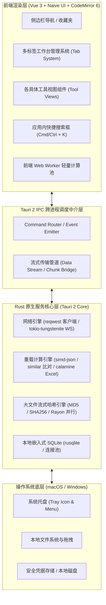

# Tauri 2 + Vue 3 跨平台开发者工具箱（DevUtils）需求与架构设计规范

**文档版本**：v1.0.0  
**创建日期**：2026-09-22  
**适用平台**：macOS (Apple Silicon & Intel) / Windows 10 & 11 (x64 & ARM64)  
**技术栈**：Tauri 2 + Rust + Vue 3 + TypeScript + Naive UI + CodeMirror 6 + UnoCSS/Tailwind + SQLite  

---

## 1. 项目概述与设计目标

### 1.1 项目背景与定位
在日常开发调试中，开发者频繁需要进行数据结构处理、网络报文探测、编码转换、时间换算及文本比对等工作。目前市面工具要么依赖在线网页（存在数据外泄风险、网络不稳定），要么客户端笨重（Electron 动辄数百兆内存、启动缓慢），要么平台割裂。

本项目旨在基于 **Tauri 2 + Vue 3** 打造一款专属于开发者的现代化、开箱即用、**完全离线、高颜值、极低资源占用且跨 macOS / Windows** 的综合工作台桌面应用。

### 1.2 核心设计目标与非功能性指标
* **流畅度（Smoothness）**：UI 交互保持稳定 60fps，大文件操作绝不阻塞渲染主线程。
* **极低内存占用（Low Memory Footprint）**：
  * 应用冷启动内存常驻控制在 **50MB - 70MB** 级别。
  * 长时间使用、多标签页并发场景下内存控制在 **120MB 以内**，具备非活动标签页 DOM 自动卸载与内存修剪机制。
* **极速启动（Instant Launch）**：冷启动时间 < 800ms，热启动 < 200ms。
* **数据精度与准确率（Zero-loss Accuracy）**：针对长数值（超过 JavaScript 安全整数范围的雪花 ID、订单号）提供无损精度保护；字符编码与转换严格遵循国际标准规范。
* **安全性与零数据外流（Privacy First）**：所有计算、数据转换与历史记录均在本地执行并保存在本地 SQLite 数据库中，杜绝任何外部上传上报。
* **极佳易用性（Ergonomics）**：
  * 支持多标签页（Tabs）并行操作与状态保存。
  * 内置全局 `Ctrl/Cmd + K` 秒级快速跳转。
  * 支持一键格式化、剪贴板快速黏贴与一键复制。
  * 自动跟随系统明亮/暗黑主题切换。

---

## 2. 系统总体架构与分层设计

### 2.1 架构拓扑
系统采用 **“声明式微内核 + 智能分层分治架构”**，整体由前端展示层、Tauri IPC 中介层、Rust 原生核心层以及本地存储层构成：



### 2.2 计算分层分治策略（Three-Tier Computation）
为杜绝 UI 卡顿并控制 IPC 传输开销，所有操作按数据量与计算特征分流：
1. **L1 前端即时响应层（Web Worker / Pure JS）**：
   * **适用场景**：时间戳秒级联动、小文本编码转换（Base64、URL、Hex）、UUID/NanoID 生成、简单正则高亮、JWT 解码、<1MB 的 JSON 美化。
   * **特点**：前端/Worker 零延迟就地计算，输入即反馈，无 Tauri IPC 往返开销。
2. **L2 Rust 原生加速层（Rust Tokio + Rayon 并行）**：
   * **适用场景**：>1MB 的大 JSON 格式化与 Key 递归排序、超大文本 Diff 比对（`similar` 库）、百兆级 Excel/CSV 解析、大于 100MB 的大文件哈希计算。
   * **特点**：利用多核并行与 SIMD 加速，以异步任务/流式进度回调通知前端，彻底解放浏览器渲染主线程。
3. **L3 Rust 原生系统服务层**：
   * **适用场景**：简易 Postman（HTTP/HTTPS）网络请求、WebSocket 客户端会话长连接维持、本地 SQLite 数据库事务。
   * **特点**：彻底规避 Webview 的 CORS 限制与浏览器的连接限制，原生支持系统代理与忽略自签名证书。

### 2.3 窗口与工作台生命周期设计
* **单一主窗口架构（MainWindow）**：
  * **macOS 风格**：原生无框或嵌入式红绿灯标题栏，视觉与系统深度融合。
  * **Windows 风格**：自定义标题栏集成最小化、最大化、关闭按钮，支持双击最大化与原生吸顶拖拽缩放。
* **多标签页（Tab）管理与内存优化**：
  * 支持打开多个工具 Tab（允许同时打开多个相同工具，如多个 Postman 请求或多个 JSON 对比）。
  * **休眠与快照机制**：对于非当前激活状态且数量超过阈值（如 >5 个）的 Tab，前端自动卸载其 CodeMirror 实例与非必要 DOM，将其内部状态序列化暂存于 Pinia 状态树中；当用户切换回该 Tab 时，在 50ms 内完成无感知重绘。
* **托盘常驻与窗口控制**：
  * 支持“关闭窗口时最小化到系统托盘”或“直接退出”（用户偏好配置项）。
  * 托盘图标右键菜单提供：显示主界面、快捷打开常用工具、退出。

---

## 3. 详细功能模块规格说明书

### 3.1 JSON 深度套件（美化 / 压缩 / 排序 / 过滤 / 修复）
* **功能描述**：全功能专业级 JSON 工作台，解决日常接口报文排版、长整数丢失、格式损坏及深层过滤问题。
* **UI 交互规范**：
  * 支持“双栏对比/分栏”与“单栏就地编辑”自由切换。
  * 顶部工具栏：一键美化（2空格/4空格/Tab）、一键压缩（紧凑单行）、Key 升序/降序递归排序、转义/去除转义字符、清空、复制、示例数据载入。
  * 底部状态栏：显示总字符数、行数、当前光标所在节点的精准 JSONPath（如 `$.data.list[2].orderId`）并支持一键复制该路径。
* **核心技术与算法细节**：
  * **大整数精度无损保护（BigInt Lossless）**：针对雪花 ID、微信/支付宝超长订单号等超过 JavaScript 安全边界（`9007199254740991`）的数值，内置无损 Tokenizer 保持原样数值串，防止末位变 `000`。
  * **容错与修复（JSON Leniency）**：内置智能修复算法，支持将不规范的类 JSON 文本（如单引号属性名、无引号 Key、尾部逗号 `trailing comma`、带 `//` 或 `/* */` 注释）一键修复为合法 JSON。
  * **JSONPath / JQ 过滤**：顶部提供查询框，支持输入标准 JSONPath 表达式进行实时树形过滤，毫秒级输出匹配子树。

### 3.2 JSON 对比工具（JSON Diff Viewer）
* **功能描述**：用于对比两个 JSON 数据间的差异，精准定位接口版本变更或配置差异。
* **UI 交互规范**：
  * 提供双栏并排（Split）与单栏内联（Inline）两种比对视图。
  * 差异标记：绿色表示新增属性，红色表示删除属性，黄色/橙色表示值变更。
  * 导航快捷键：`Alt + ↑` 跳转上一个差异点，`Alt + ↓` 跳转下一个差异点。
  * 顶部汇总指示器：如 `新增 2 项 | 删除 1 项 | 修改 4 项`。
* **核心技术与算法细节**：
  * **语义级比对（Semantic Diff）**：提供“原文本比对”与“语义比对”开关。在语义模式下，即使两个 JSON 的 Key 出现次序不一致，对比引擎在预处理阶段先进行标准化 Key 排序，避免伪差异干扰。
  * **忽略选项**：支持“忽略空白字符/空行”、“忽略字段大小写”。
  * **报告导出**：支持一键复制差异摘要，或导出 HTML 格式对比报告。

### 3.3 WebSocket 实时测试工具
* **功能描述**：支持对 `ws://` 和 `wss://` 服务端进行全流程握手、心跳维护、自定义消息收发与长连接监控。
* **UI 交互规范**：
  * 顶部配置栏：URL 输入框、连接/断开按钮、状态指示灯（未连接/连接中/已连接/异常断开）。
  * 配置抽屉（Settings）：自定义请求 Headers（如 `Authorization`）、自定义 Sub-Protocols。
  * 中部消息历史区：消息流瀑布流，清晰区分 `IN`（下行）与 `OUT`（上行）及 `SYSTEM`（系统连接/断连事件），每条消息标注纳秒级时间戳与包大小。
  * 底部发送区：支持 JSON 语法高亮与格式化校验，快捷键 `Ctrl/Cmd + Enter` 发送。
* **核心技术与功能细节**：
  * **连接底座**：基于 Rust `tokio-tungstenite` 异步驱动，支持持久高吞吐连接，支持配置跳过自签名 SSL 校验。
  * **心跳保活（Heartbeat Ping/Pong）**：支持配置自动心跳包（可指定发送间隔，如 30 秒，支持纯文本 Ping 或自定义 JSON 报文）。
  * **常用指令模板库（Presets）**：开发者可将高频测试报文（如登录鉴权包、业务订阅包）保存为快捷按钮，一键点击填充并发送。
  * **流式日志过滤**：支持按方向（全部 / 仅接收 / 仅发送）过滤，支持关键词实时检索，支持锁定/解锁自动滚动，支持一键导出日志（`.json` / `.log`）。

### 3.4 JWT 解析与调试工具
* **功能描述**：用于解析、检查、验证和重新生成 JSON Web Token。
* **UI 交互规范**：
  * 左栏为原始编码 Token 输入区，自动对 `Header`（红）、`Payload`（紫）、`Signature`（青）三段进行色彩高亮划分。
  * 右栏为结构化 JSON 展示与编辑区。
* **核心技术与功能细节**：
  * **Base64URL 健壮解码**：标准解码兼容无 padding（末尾缺少 `=`）的 Token 串。
  * **Claims 智能时效雷达**：
    * 自动解析 `iat`（签发时间）、`nbf`（生效时间）、`exp`（过期时间）并格式化为本地易读时间。
    * 提供倒计时徽标：绿色（有效中，剩余时间 XX:XX:XX）、红色（已过期，显示已失效天数与具体时间）、黄色（尚未生效）。
  * **签名验证与反向重签（Verify & Re-Sign）**：
    * 支持输入对称密钥（HS256/HS384/HS512）或公私钥（RS256/ES256）验证签名合法性。
    * 支持在右侧直接篡改 Payload 内容后，输入新密钥一键生成合法的全新 JWT 字符串，极大便利后端接口鉴权调试。
  * **安全漏洞感知**：检测到 `alg: "none"` 或极短弱口令时在 UI 上展现黄色预警提示。

### 3.5 Excel 文本转 JSON / SQL 工具
* **功能描述**：将 Excel/CSV 数据或直接从办公软件复制的表格快速转换为 JSON 数组或结构化 SQL 脚本。
* **UI 交互规范**：
  * 输入区：支持文件拖拽上传（`.xlsx`、`.xls`、`.csv`）以及直接从剪贴板粘贴（TSV 文本）。
  * 配置区：选择输出目标（JSON / SQL）、表头行设置、SQL 方言选择、表名设置。
  * 输出区：格式化代码展示，支持一键复制与文件下载。
* **核心技术与功能细节**：
  * **字段类型智能推导**：扫描列数据，自动识别并推导为 `INT`、`BIGINT`、`DECIMAL`、`DATETIME`、`BOOLEAN` 或 `VARCHAR`。
  * **SQL 方言适配**：支持 **MySQL / PostgreSQL / SQLite / Oracle**：
    * 自动生成包含字段定义的 `CREATE TABLE` 建表语句。
    * 生成高性能批量插入语句（如每 500 行合并为一个 `INSERT INTO table VALUES (...), (...)`）。
    * 特殊字符（单引号转义、反斜杠、空值 `NULL` 映射）自动处理，杜绝语法异常。
  * **JSON 多格式支持**：支持输出为对象数组 `[{"id": 1, "name": "foo"}]`、扁平映射或二维数值矩阵。

### 3.6 信息编码转换与哈希计算（Encoding & Hash Studio）
* **功能描述**：一站式解决开发中各类编解码与哈希校验需求。
* **功能与算法矩阵**：
  * **Base64**：标准 Base64、URL-Safe Base64 互转，支持 UTF-8 多字节汉字防乱码。
  * **URL 编解码**：支持 `encodeURIComponent` 与 `encodeURI` 两种规范，提供常见保留字符快速转义。
  * **Unicode 互转**：中文字符与 `\u4e2d\u6587` 互转，支持全量展开模式。
  * **Hex / 十六进制**：字符串与十六进制 Hex 双向转换，可配置分隔符（空格、逗号、`0x` 前缀）。
  * **HTML Entities**：HTML 特殊实体编解码（如 `<` ↔ `&lt;`，`&` ↔ `&amp;`）。
  * **哈希计算（Hash / HMAC）**：
    * 支持 MD5（32位大写、32位小写、16位大写、16位小写）、SHA-1、SHA-256、SHA-512、SHA-3。
    * 支持配置自定义 Salt（加盐）与 HMAC 密钥。
  * **超大本地文件哈希秒算**：支持直接拖拽超大文件（10GB+）进入窗口，Rust 采用多线程分块流式计算哈希值，提供实时百分比进度条，内存占用恒定 < 20MB。

### 3.7 时间戳与本地化时间互转（Timestamp & Timezone Hub）
* **功能描述**：用于快速转换不同精度的时间戳、不同时区时间以及模拟 Cron 定时表达式。
* **UI 交互规范**：
  * 顶部动态时钟：显示当前本地时间与当前秒级/毫秒级时间戳，支持一键复制与暂停刷新。
  * 转换卡片：支持在秒（10位）、毫秒（13位）、微秒（16位）、纳秒（19位）间自由切换。
  * 批量转换面板：支持多行多格式时间数据一次性粘贴批量解析转换。
* **核心技术与功能细节**：
  * **常用格式矩阵**：输入一个时间，自动并排输出 ISO 8601、RFC 2822、UTC 时间、以及人类友好相对时间（如 `3小时前`、`下周一`）。
  * **全球时区换算**：支持在当前本地时区、UTC、美东（EST/EDT）、欧洲（CET/CEST）、东京（JST）等常用时区之间一键换算对比。
  * **Cron 表达式可视化与推算**：
    * 支持标准 5 位（Linux Crontab）与 6/7 位（Quartz / Spring）表达式输入。
    * 将 Cron 表达式逆向解析为通俗中文自然语言描述。
    * **未来触发模拟**：精准推算并列出该规则未来 **10 次具体触发时间列表**。

### 3.8 图片与 Base64 互转与轻量处理
* **功能描述**：解决前端与移动端开发中内嵌小图标、Base64 资源还原的诉求。
* **UI 交互规范**：
  * 支持图片拖拽上传、系统文件选择、以及从剪贴板直接粘贴图片（截屏后 `Ctrl/Cmd + V` 即刻载入）。
* **核心技术与功能细节**：
  * **导出格式全覆盖**：一键生成并复制：纯 Base64 字符串、Data URL（`data:image/png;base64,...`）、HTML `` 标签、CSS `background-image` 样式。
  * **Base64 还原图片**：自动识别带或不带前缀的 Base64 字符串，即刻呈现图片预览，展示图片宽度、高度与体积大小，支持一键复制图片到系统剪切板或另存为本地文件。
  * **轻量压缩与格式互转**：支持调节压缩质量（0.1~1.0），支持在 PNG、JPEG、WebP 格式间互转，实时对比压缩前后体积。

### 3.9 YAML / Properties / JSON 互转工具
* **功能描述**：解决微服务与前端配置（`application.yml`、`config.properties`、`app.json`）间的格式迁移转换。
* **UI 交互规范**：
  * 支持双向或三栏实时联动编辑（JSON ↔ YAML ↔ Properties），在任意一栏修改，其余两栏防抖实时生成。
* **核心技术与转换规则**：
  * **多层嵌套与点分扁平化（Flatten / Unflatten）**：实现嵌套对象与 Properties 风格点分键（如 `spring.datasource.url`）之间的无损双向互转。
  * **数组表示法兼容**：支持 `servers[0].url` 与 `servers.0.url` 两种主流数组解析模式。
  * **类型保真**：布尔值、数字（整数与浮点数）、空值（`null` 与空字符串）严格保持原始类型，不发生失真。

### 3.10 Markdown / HTML 互转与实时预览
* **功能描述**：提供开发者友好的文档编写、实时渲染与双向格式清洗转换。
* **UI 交互规范**：
  * 左侧为 CodeMirror 6 Markdown 源码编辑器，右侧为优雅渲染预览区。
  * **视口精准同步滚动**：左侧滚动时，右侧预览依据当前元素行号精准平滑对齐。
* **核心技术与功能细节**：
  * **完备语法支持**：支持 GFM 表格、任务复选框、代码块高亮（Prism/Highlight）、数学公式（KaTeX）。
  * **双向无损互转**：
    * Markdown 一键导出为干净无冗余的 HTML 源码片段或完整 HTML 文档。
    * HTML 文本逆向清洗解析为标准 Markdown（自动过滤多余 style 与冗余 div）。
  * **导出能力**：一键导出为 `.md` 文件、带独立样式的 `.html` 单文件或一键复制。

### 3.11 简易 Postman（轻量原生 HTTP/HTTPS 客户端）
* **功能描述**：用于快速调试 RESTful API 接口，免除打开庞大重型商业软件的困扰。
* **UI 交互规范**：
  * 顶部：请求方法选择器（彩色 Method 标签）、URL 输入框（支持变量）、发送按钮、保存按钮。
  * 请求面板 Tabs：
    * `Params`：Query 参数键值对表格，支持单个参数启用/禁用复选框，与 URL 双向同步。
    * `Headers`：请求头键值对表格，支持常见 Header 智能提示，支持一键切换为纯文本批量编辑。
    * `Body`：支持 `none`、`form-data`（支持选择本地文件）、`x-www-form-urlencoded`、`raw`（JSON/XML/Text，带语法高亮）、`binary`（二进制文件流）。
    * `Auth`：支持 `None`、`Bearer Token`、`Basic Auth`、`API Key`。
    * `Settings`：忽略 SSL 证书校验、允许重定向、请求超时设置（秒）。
  * 响应面板：
    * 状态信息栏：HTTP Status Code、耗时（ms）、响应体大小（KB）。
    * Body 视图：Pretty（高亮/折叠/检索）、Raw（原始报文）、Preview（网页预览/图片直显）。
    * Headers & Cookies：响应标头明细与 Cookie 列表。
* **核心技术与功能细节**：
  * **Rust 原生网络栈**：基于 `reqwest` 异步客户端驱动，**完全无视浏览器同源策略（零 CORS 限制）**，支持自签名证书忽略与网络代理设置。
  * **环境变量系统**：支持配置多套环境（如开发、测试、生产），支持 `{{baseUrl}}` 动态插值与内置变量（`{{$timestamp}}`、`{{$uuid}}`）。
  * **cURL 深度互通**：支持从剪贴板一键导入 cURL 命令自动解析为请求结构；支持将当前请求一键导出为 cURL 命令行或 Fetch/Python/Go 代码。
  * **历史记录与集合管理**：本地 SQLite 自动记录最近请求历史（支持一键清空或按时间检索），支持将请求归类保存至“集合目录（Collections）”。

### 3.12 正则表达式测试与分析器（Regex Playground）
* **功能描述**：实时验证正则表达式、可视化捕获组并生成生产代码。
* **UI 交互规范**：
  * 顶部：正则表达式输入框、修饰符开关组（`g`、`i`、`m`、`s`、`u`）。
  * 中部：待测文本编辑区，所有匹配文本实时使用交替背景色高亮标注。
  * 底部选项卡：
    * `捕获组明细（Match Details）`：表格列出匹配序号、区间位置、完整匹配文本以及分项捕获组（含具名捕获组 `(?<group>...)`）。
    * `正则替换（Replace）`：输入替换模板（支持 `$1` 或 `$<name>`），实时展现替换后全文字符串。
    * `常用模板库（Cheat Sheet）`：内置手机号、邮箱、IP、身份证、URL 等数十种高频正则，一键载入。
    * `代码生成`：一键导出 JavaScript、Python、Java、Go、Rust 语言调用代码片段。

### 3.13 UUID / NanoID / 唯一标识生成器
* **功能描述**：用于单条或大批量生成各类符合业界标准的唯一标识符。
* **算法支持**：
  * **UUID v4**（强伪随机算法）。
  * **UUID v1**（时间戳基底算法）。
  * **UUID v7**（Unix Epoch 时序排序 UUID，数据库高并发主键推荐规范）。
  * **NanoID**（轻量 URL 友好随机串，支持自定义字母表与指定长度）。
  * **Snowflake ID**（雪花算法，模拟 64 位整型 ID，可配置机器与数据中心编号）。
* **控制参数与格式化**：
  * 批量数量：支持单次生成 1 ~ 10,000 个。
  * 格式选项：大写 / 小写、带连字符 `-` / 无连字符连续串、外层双引号包裹 / 纯文本换行 / JSON 数组 / SQL `IN (...)` 语法。
  * 一键复制全部结果或一键导出为 `.txt` 文件。

---

## 4. 本地持久化与 SQLite 数据模型

应用所有持久化数据均储存在操作系统用户应用数据目录下的 SQLite 数据库（`app.db`）中，确保安全无泄漏。

### 4.1 数据表设计

```sql
-- 1. 全局与用户配置表
CREATE TABLE IF NOT EXISTS sys_settings (
    key TEXT PRIMARY KEY,
    value TEXT NOT NULL,
    updated_at INTEGER NOT NULL
);

-- 2. 工具状态快照表（支持关闭后重启恢复工作现场）
CREATE TABLE IF NOT EXISTS tool_state_snapshots (
    tool_id TEXT PRIMARY KEY,
    snapshot_json TEXT NOT NULL,
    updated_at INTEGER NOT NULL
);

-- 3. Postman 环境变量集合表
CREATE TABLE IF NOT EXISTS http_environments (
    id TEXT PRIMARY KEY,
    name TEXT NOT NULL,
    variables_json TEXT NOT NULL, -- {"baseUrl": "https://api.dev", ...}
    is_active INTEGER DEFAULT 0,
    created_at INTEGER NOT NULL
);

-- 4. Postman 收藏夹与请求集合表
CREATE TABLE IF NOT EXISTS http_collections (
    id TEXT PRIMARY KEY,
    parent_id TEXT, -- 支持树状多级文件夹
    name TEXT NOT NULL,
    sort_order INTEGER DEFAULT 0
);

-- 5. Postman 请求详情表
CREATE TABLE IF NOT EXISTS http_requests (
    id TEXT PRIMARY KEY,
    collection_id TEXT,
    name TEXT NOT NULL,
    method TEXT NOT NULL,
    url TEXT NOT NULL,
    headers_json TEXT,
    params_json TEXT,
    body_type TEXT,
    body_content TEXT,
    auth_json TEXT,
    settings_json TEXT,
    created_at INTEGER NOT NULL,
    updated_at INTEGER NOT NULL,
    FOREIGN KEY(collection_id) REFERENCES http_collections(id) ON DELETE CASCADE
);

-- 6. Postman 请求执行历史记录表（限制保留最近 500 条）
CREATE TABLE IF NOT EXISTS http_history (
    id TEXT PRIMARY KEY,
    method TEXT NOT NULL,
    url TEXT NOT NULL,
    status_code INTEGER,
    duration_ms INTEGER,
    request_data_json TEXT,
    response_summary_json TEXT,
    executed_at INTEGER NOT NULL
);

-- 7. WebSocket 消息快捷模板表
CREATE TABLE IF NOT EXISTS ws_message_templates (
    id TEXT PRIMARY KEY,
    title TEXT NOT NULL,
    message_type TEXT NOT NULL, -- 'TEXT' | 'HEX'
    payload TEXT NOT NULL,
    created_at INTEGER NOT NULL
);
```

---

## 5. 跨平台适配与桌面级体验规范

### 5.1 窗口与标题栏行为规范
* **macOS 适配**：
  * 采用原生隐藏标题栏（`titleBarStyle: "Overlay"`），保留左上角系统原生交通灯（红绿灯）控制按钮。
  * 侧边栏与主工作区顶部保留安全拖拽区域（`data-tauri-drag-region`），支持全窗口手势双击最大化与平滑拖动。
* **Windows 10 / 11 适配**：
  * 采用自定义无边框沉浸式窗口，右上角配备标准 Windows 风格最小化、最大化/还原、关闭按钮。
  * 窗口四周提供 4px 隐形边缘，支持平滑缩放手势；支持 Windows 11 Snap Layout 贴靠布局。

### 5.2 快捷键矩阵映射
| 功能动作 | macOS 快捷键 | Windows 快捷键 |
| :--- | :--- | :--- |
| 应用内工具快搜切换 | `Cmd + K` | `Ctrl + K` |
| 关闭当前标签页 | `Cmd + W` | `Ctrl + W` |
| 切换标签页 | `Cmd + 1 ~ 9` / `Cmd + Option + ←/→` | `Ctrl + 1 ~ 9` / `Ctrl + Tab` |
| 执行格式化 / 美化 | `Cmd + Shift + F` | `Ctrl + Shift + F` |
| 发送请求 (Postman / WS) | `Cmd + Enter` | `Ctrl + Enter` |
| 代码对比上一个/下一个差异 | `Option + ↑ / ↓` | `Alt + ↑ / ↓` |

---

## 6. 验证与验收准则（Verification & Criteria）

### 6.1 功能完备性测试用例
1. **长整数防丢失测试**：输入带有 19 位数字雪花 ID 的 JSON，执行格式化与压缩后，末位数字不发生截断或精度降级。
2. **CORS 穿透测试**：在 Postman 模块向配置了严格 CORS 的目标测试接口发送复杂请求，能够正常获取 Headers 与 Body，且不触发跨域错误拦截。
3. **大文件哈希测试**：拖入一个 5GB 大小的系统镜像文件，哈希计算进度平稳递增，主界面不掉帧，计算出的 SHA-256 与系统命令行 `shasum -a 256` 结果完全一致。
4. **WebSocket 稳定性测试**：连接到本地或公网 WebSocket 服务端，开启 10 秒心跳包，保持连接 1 小时，无异常中断，收发日志清晰完整。
5. **Excel/TSV 转换测试**：从 Excel 复制包含日期、大整数、浮点数、中英文混合及空值的表格数据粘贴，转换出的 SQL 建表及 Insert 语句在 MySQL 与 PostgreSQL 中均可一次性执行成功。

### 6.2 性能与资源指标验证
1. **冷启动时间**：通过性能监视器记录进程从触发启动到首屏加载完成，macOS / Windows 平台耗时均小于 800ms。
2. **基准常驻内存**：启动后静置 1 分钟，应用物理内存占用（Working Set / RSS）< 70MB。
3. **多 Tab 并发内存控制**：同时打开全部 13 款工具各一个 Tab，静置 2 分钟后，总内存占用 < 120MB。
4. **大文本渲染流畅度**：向 JSON 工具粘贴 100,000 行合法 JSON 文本，滚动编辑时保持 60fps，不出现白屏或挂死。
